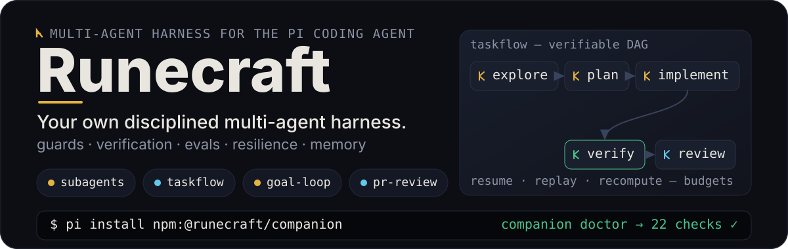
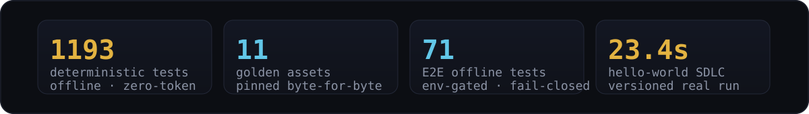

# @runecraft/companion

<p align="center">
  
</p>

Runecraft Harness — umbrella meta-package for the [Pi coding agent](https://pi.dev). Installs and wires the four forked components (`@runecraft/subagents`, `@runecraft/taskflow` group, `@runecraft/goal-loop-audit`, `@runecraft/pr-review`) **plus the harness layer** — enforced guards, verification cascade, evals with ratchets/goldens, resilience, event store, memory, persona and coded routing — in a single command.

## What it is

The harness ships as a meta-package: the forks are bundled via `bundledDependencies` and their resources are referenced by `node_modules/@runecraft/*` paths in the `pi` manifest (the standard meta-package pattern documented in Pi's docs/packages.md). Versions come from the committed fork packages (see `src/versions.ts`).

| Capability | Package | Entry (manifest `pi`) |
| --- | --- | --- |
| Subagent dispatch | `@runecraft/subagents` 0.37.2 | `node_modules/@runecraft/subagents/index.ts` + `skills/` + `prompts/` |
| Task DAG (`/tf`) | `@runecraft/taskflow` 0.2.6 | `node_modules/@runecraft/taskflow/dist/index.js` + `skills/` |
| Taskflow engine + DSL (libs) | `@runecraft/taskflow-core` 0.2.6 · `@runecraft/taskflow-dsl` 0.2.6 | no `pi` resources (libs only) |
| Goal loop with isolated auditor (`/goal`) | `@runecraft/goal-loop-audit` 0.28.34 | `node_modules/@runecraft/goal-loop-audit/extensions/loops/goal.ts` |
| PR code review | `@runecraft/pr-review` 1.11.4 | `node_modules/@runecraft/pr-review/extensions/index.ts` + `prompts/` |

The harness layer ships as extensions in the same `pi` manifest: `guards.ts`, `resilience.ts`, `observability.ts`, `memory.ts`, `persona.ts`, `routing.ts` and `harness-status.ts` — plus the shipped skills (`using-runes`, `skill-forge`, `test-driven-development`, `using-agent-skills`, `memory-management`, `spec-driven`).

## Proof / value

<p align="center">
  
</p>

- **Enforced guards** (F24) — real `{ block: true }` tool-call blocking, not prompt advice.
- **Verification cascade** (F25) — deterministic cheap→expensive with thresholds in code; judge LLM env-gated.
- **Evals + ratchets + goldens** (F21/F23/F26) — 1193 deterministic tests, fail-only-on-worse ratchets, 11 pinned goldens.
- **Resilience** (F27) — compaction recovery, continuation, stall detection.
- **Typed event store** (F28) — append-only events, prevHash chain, lessons.
- **Memory** (F29) — persistent SQLite+FTS5 with `rune_*` tools and the `using-runes` skill.
- **Coded routing** (F33) — route by code, never by LLM.
- **E2E benchmark** (F22) — real models, env-gated, cost-capped, versioned rounds.

## Quickstart

```bash
pi install npm:@runecraft/companion     # global
pi install npm:@runecraft/companion -l  # project-local (.pi/settings.json)
```

The CLI is `companion` (alias `harness`). Verify the install:

```bash
companion doctor                        # read-only diagnostics (pass/warn/fail + remedy)
companion status                        # cross-state report: pi list × state × manifest
pi -p "/tf --help"                      # taskflow responds
pi -p "/goal status"                    # goal-loop-audit responds
pi -p "subagent({action:'list'})"       # subagents responds
pi -p "/pr-review --help"               # pr-review responds
```

A new Pi session loads the extensions of all four forks plus the harness layer: `/tf`, `/goal`, `subagent({action:"list"})`, `/pr-review` respond in the same session, with guards, verification, resilience, observability, memory, persona and routing active.

## Core workflow

| Tool | What it does | When to use it | When not |
| --- | --- | --- | --- |
| **goal-loop-audit** (`/goal`) | goal with a "Done when" contract, verified by an isolated auditor (regression shield) | closable by a verifiable contract; iteration with an honest metric (`/loop`) | no verifiable "Done when"; interactive driving |
| **taskflow** (`/tf`) | DAG with `dependsOn`, resume/replay/recompute, approvals vs gates, budgets | multi-phase flows with dependencies; reproducibility; a defined budget | single-file change; interactive debugging |
| **subagents** | chains, parallel, acceptance gates, intercom, worktrees, watchdog | ad-hoc delegation; independent parallelism; evidence via acceptance gates | multi-phase flows with dependencies (→ taskflow); session-driving work (→ goal-loop) |
| **pr-review** (`/pr-review`) | structured verdict, parallel tiers, gate inside a flow | reviewing a diff; pre-commit/pre-push gate | — |

Full mental model, the 7 objective roles and the routing rules:
[`docs/ROUTING.md`](docs/ROUTING.md).

## Intended usage

**Role agents.** The harness ships 7 professional roles, materialized as data-driven agents in `<cwd>/.pi/agents/` via `companion install`/`sync` (project scope; three-way merge by content — your edits are preserved):

| Role | Identity | Tools (allowlist) | Delegation |
| --- | --- | --- | --- |
| `planner` | plans only — never implements | read, grep, find, ls, intercom | never |
| `builder` | executes the plan, verifies before reporting | read, grep, find, ls, bash, edit, write, intercom, contact_supervisor, subagent | only: scout + reviewer |
| `reviewer` | `[APPROVE]`/`[REJECT]` verdict + ≤3 blocking issues (read-only) | read, grep, find, ls, bash, intercom | never |
| `auditor` | compliance audit (writes only `.md`) | read, grep, find, ls, bash, write, intercom | never |
| `scout` | read-only codebase recon, reports on return | read, grep, find, ls, intercom | never |
| `researcher` | external research with sources (read-only) | read, grep, find, ls, web_search, fetch_content, get_search_content, intercom | never |
| `security` | read-only security review (triage + fast-exit) | read, grep, find, ls, bash, intercom | never |

**Non-Pi agents.** The CLI also manages non-Pi agents in the same detect/inject/remove pattern: Claude Code (`claude-code`), OpenCode (`opencode`), Codex (`codex`) and Copilot for VS Code (`copilot`; aliases `vscode`, `vscode-copilot`, `github-copilot`). Copilot receives repo-scoped rules in `.github/copilot-instructions.md` plus MCP in `.vscode/mcp.json` (`servers.taskflow`, reusing the `@runecraft/taskflow-claude` host).

See [docs/agents.md](docs/agents.md) for the full matrix and [docs/ROUTING.md](docs/ROUTING.md) for the mental model.

## Configuration

Each fork ships its own defaults and docs (`subagents.defaultModel`, the goal-loop-audit auditor model, taskflow budgets, …). The recommended `settings.json` block covering all four packages (merge of defaults) is delivered by the harness CLI — `companion install` writes it; see the doctor output for the effective state. The harness layers add their own sections (`guards`, `verification`, `resilience`, `observability`, `memory`, `persona`, `models`) — see [docs/components.md](docs/components.md).

## Troubleshooting

- `companion doctor` — read-only diagnostics: pass/warn/fail checks with a remedy for each failure.
- `companion status` — installed packages and versions, cross-state report (pi list × state × manifest), install suggestion when nothing is managed.
- `companion sync` — idempotent reconciliation: reinstalls what the harness manages and is missing.
- `companion uninstall` — managed removal: removes **only** what the harness installed (`--component <id>` / `--all`).
- `companion restore <name>` / `companion backups` — snapshot restore and listing.
- **Collision warning**: do not install alongside the original upstreams (`pi-subagents`, `pi-taskflow`, `pi-goal-list-loop-audit`, `pi-pr-review`) — commands and tools duplicate. Remove the upstreams before installing the harness.

## Relationship to upstreams

| Package | Upstream | Pinned | README |
| --- | --- | --- | --- |
| `@runecraft/subagents` | `pi-subagents` (nicobailon) | v0.37.2 | [subagents](../subagents/README.md) |
| `@runecraft/taskflow` (group) | `taskflow` (heggria) | v0.2.6 | [taskflow](../taskflow/README.md) |
| `@runecraft/goal-loop-audit` | `pi-goal-list-loop-audit` (DraconDev) | 0.28.34 | [goal-loop-audit](../goal-loop-audit/README.md) |
| `@runecraft/pr-review` | `pi-pr-review` (10ego) | v1.11.4 | [pr-review](../pr-review/README.md) |

Each fork's README documents its relationship to the upstream and the notable divergences. The forks are committed source in this repo — there is no sync workflow.

## Docs

- [Docs index](docs/README.md) — ROUTING / EVENTS / MEMORY / PI / EVAL-FRAMEWORK + intended-usage / usage / agents / components / CODEBASE-GUIDE / testing.
